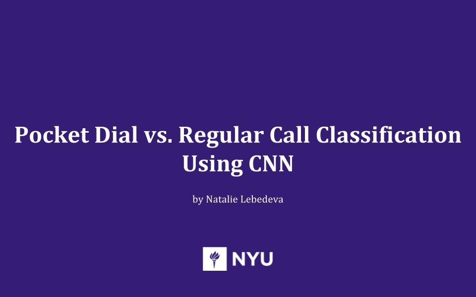

# Pocket Dial vs. Regular Call Classification

My project for the Intro to Machine Learning class attempts to classify pocket dials vs. regular calls. The project idea was inspired by multiple reports about pocket dials wasting 911 operators' valuable time.

http://www.techtimes.com/articles/92149/20151007/911-calls-from-accidental-butt-dials-are-becoming-a-major-problem-for-emergency-services-google-report.htm

My approach is to teach a Convolutional Neural Network to distinguish between spectrograms obtained from pocket dial audio and speech audio files.

Some of the data processing code based on the code I found here: https://github.com/despoisj/DeepAudioClassification

For this project, I created a pocket dial audio dataset. The audio files can be accessed at https://mega.nz/#F!KwcByYYY!lZhZUkHDf-1hLGCDCh7fzA

Jupyter Notebook with the detailed description and implementation can be viewed here:
https://github.com/nataliest/ML_final_project/blob/master/src/Pocket_dial_vs_regular_call_CNN.ipynb

